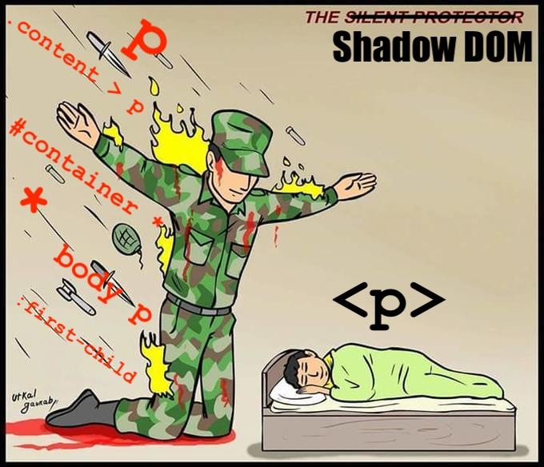
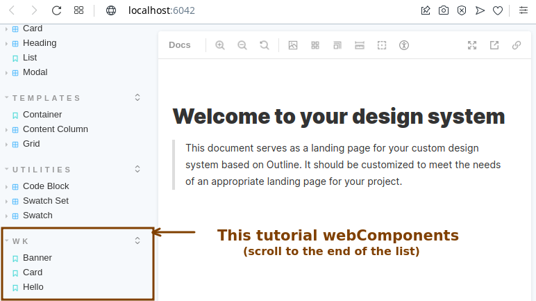

# Hands On talk about Web Components

## Setting up your sandbox environment

Once you have cloned this repository locally and if you have [Docksal installed](https://docs.docksal.io/getting-started/setup/) in your machine, you should be able to run the following:

```
fin init
fin wk-setup
fin drush uli
```

This will leave you with a Drupal 9.1 installation using Olivero as the theme and some content.
The ```wk-setup``` step will leave [Outline](https://github.com/phase2/outline) design system ready to continue the next step.

### Using Phase2 Outline

For outline you'll need to use [Node v16](https://nodejs.org/en/download/package-manager/#nvm) & [Yarn v1](https://classic.yarnpkg.com/lang/en/docs/install/).
Once you have them installed you can run the following commands:

```
cd outline/
yarn install
yarn start
```

This will start Storybook and keep updating when you do changes.

If you need to run a build or check compiled output you can run ```yarn build```, but given the Docksal setup it is best to simply use:

```
fin wk-sync
```

Which compiles outline and update Drupal theme with it.

## webComponent examples

When using outline/webComponents you'll have two realms:

- The Storybook version of the component where you can refine and test it.
- The compiled version of your webComponent which ```fin wk-sync``` builds and exports to Drupal so you can use them on your template.

First we will go over some webComponent examples which you will be able to check within Storybook. In the next chapter "Drupal Integration" we will use them.

### A brief webComponents introduction

Some background about outline and technologies behind it:

- webComponents have been around for a while now ([v1 implementation 2018](https://medium.com/@pablortsal/the-year-of-web-components-c92960830d00)) and it is supported by [most mayor browsers](https://developer.mozilla.org/en-US/docs/Web/Web_Components#browser_compatibility).
- You can use webComponents directly by calling the browser API, but it is simpler to use libraries like [StencilJS](https://stenciljs.com/) or [LitJS](https://lit.dev/) (currently being used by Outline).
- webComponents use a [ShadowDOM](https://developer.mozilla.org/en-US/docs/Web/Web_Components/Using_shadow_DOM): This shadow DOM tree is rendered separately from the main document DOM. It allows to encapsulate your CSS within it, and protects it from outside interference. As a side effect, styles from outside won't have any effect on your webComponent.
- All webComponents have a [lifeCycle](https://developer.mozilla.org/en-US/docs/Web/Web_Components/Using_custom_elements#using_the_lifecycle_callbacks) and they are similar to React components.
- For people using Drupal, there is an initiative to create webComponents for different Drupal objects. In particular the [decouple Menus/module initiative](https://www.drupal.org/project/decoupled_menus_initiative) is an interesting starting point ([mentioned by Dries in DrupalCon 2020 EU](https://dri.es/state-of-drupal-presentation-july-2020)).



In this handson you'll have examples of how to create a webComponent using outline, pass to it attributes & use slots to receive HTML.

These are some Web Components 101 articles you might find useful:

- [History](https://dev.to/this-is-learning/web-components-101-history-2p24)
- [Vanilla JavaScript](https://dev.to/this-is-learning/web-components-101-vanilla-javascript-2pja)
- [Lit Framework](https://dev.to/this-is-learning/web-components-101-lit-framework-3en1)
- [Framework Comparison](https://dev.to/this-is-learning/web-components-101-framework-comparison-989)

### Scenario 1: webComponent Hello World

In the [initial hello example](https://github.com/weknowinc/webcomponents_handson/tree/main/resources/wkwc/wk-hello) you'll find 3 files:

- The style file `wk-hello.css`: Which in this initial case doesn't have code.
- The TypeScript file with the webComponent description `wk-hello.ts`: Interesting thing about it is the inclussion of LIT an outline components which make everything work. In this simple example we create a component, nothing more.
- The Storybook file `wk-hello.stories.ts` with an example use of the defined webComponent: It just shows the created webComponent within StoryBook. It is interesting to see the line <code>title: 'WK/Hello'</code> which defines the StoryBook category.



Once you have run Yarn you'll also have an output file used by Storybook's implementation `wk-hello.css.lit.ts` which has the compiled output and should be ignored (it is used by the Storybook implementation).

### Scenario 2: webComponent gets simple string attributes

For [the card example](https://github.com/weknowinc/webcomponents_handson/tree/main/resources/wkwc/wk-card) we use attributes to configure the webComponent:

- The style file `wk-simple-card.css`: The only say to say about it is the particular syntax to refer to the webcomponent name. Instead of the name, we add "&" and that will be interpreted as the webcomponent name.
- The TypeScript file with the webComponent description `wk-simple-card.ts`: You can first see the explicit declaration of the attributes (aka property) and the html template which uses the properties.
- The Storybook file `wk-simple-card.stories.ts` with an example use of the defined webComponent: This can also be used as an implementation example. You will first need to export the properties, grab them in the template and use the webComponent.

As opposed to the initial example, these does use CSS rules which are compiled into `wk-simple-card.css.lit.ts` so `wk-simple-card.stories.ts` can use them.

### Scenario 3: webComponent gets HTML data as a slot

We will now use slots instead of properties to pass information to the webComponent. As we saw attributes could be string, but if you use slots you can pass HTML code directly to the webComponent. In [banner example](https://github.com/weknowinc/webcomponents_handson/tree/main/resources/wkwc/wk-banner) we will use a single (default) slot, but we will see later that we could have more.

By using the [HTMLSlotElement](https://developer.mozilla.org/en-US/docs/Web/API/HTMLSlotElement) (`<slot></slot>`) we can pass to the webComponent the HTML we want it to render inside it (see [Lit exaplanation](https://lit.dev/docs/components/shadow-dom/#slots)).

## Drupal Integration

First we derived from Drupal's latest theme Olivero a subtheme we are calling "weKnow Outline Theme", within it's ```wkth.libraries.yml``` file we include the outline output JS+CSS files and configure it so webComponents are available to the theme. The only difference between a regular subtheme with JS+CSS inclusion and the export of webComponents can be seen in this screenshot:


Once this is done (you have it pre-setup in this hands on), you can simply tweak the twig file as you would always do. The "attributes type module" is what makes them "magically" available. Now you can use the webComponents on your twig.

Now in the [node--teaser.html.twig template](https://github.com/weknowinc/webcomponents_handson/blob/main/resources/wkth/templates/content/node--teaser.html.twig) we can see the use of ```wk-banner``` webComponent and pass one the attribute "rounded" and the slot "heading". That's enough to glue everything together.

## CleanUp

```
fin stop
fin project remove
fin wk-cleanup
```
